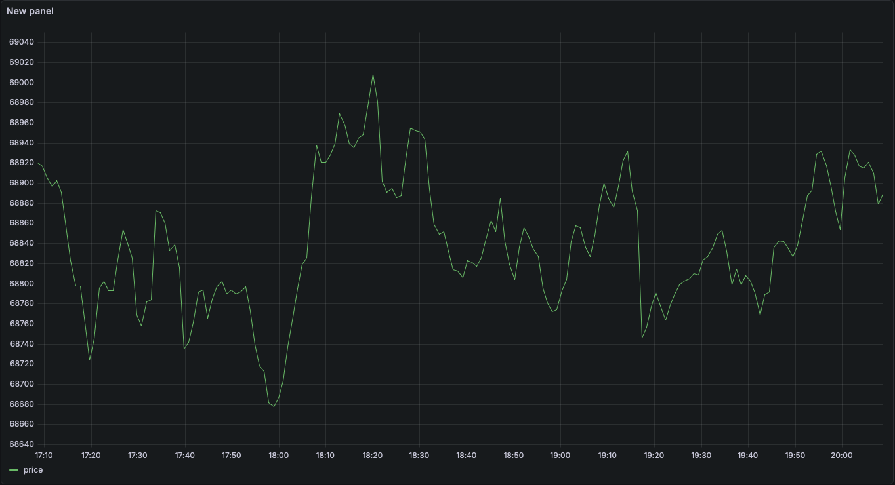

# 🚀 Crypto Tracker: DevOps End-to-End Project

A cryptocurrency monitoring platform built with microservices architecture, Infrastructure as Code (IaC), and Kubernetes orchestration.



## 🏗️ Architecture

* **Backend:** FastAPI (Python) exposes the data.
* **Worker:** Background service (Python) that queries CoinGecko and writes to DB.
* **Data:** PostgreSQL (Persistence) & Redis (Cache).
* **Visualization:** Grafana (Real-time dashboards).
* **Infrastructure:** Terraform (LocalStack for S3/DynamoDB) & Kubernetes (Minikube).
* **CI/CD:** GitHub Actions (Multi-Arch ARM/AMD Build) -> Docker Hub.
* **Orchestration:** Custom Helm Charts.

## 🛠️ Technologies

`Python` `Docker` `Kubernetes` `Terraform` `GitHub Actions` `Helm` `Postgres` `Redis` `Grafana`

---

## 🚀 How to Run Locally

### Option A: Docker Compose Mode (Quick)

Ideal for local development without Kubernetes.

1. Clone the repo.
2. Start everything:
   ```bash
   docker-compose up --build -d
   ```
3. Access the API: `http://localhost:8080/prices`

### Option B: Kubernetes Mode (Full DevOps)

The complete experience with orchestration.

**Prerequisites:** Minikube, Kubectl, Helm.

1. **Start Cluster:**
```bash
minikube start --driver=docker
```

2. **Deploy with Helm:**
```bash
helm install v1 ./k8s/crypto-app
```

3. **Access the API:**
Since we use `ClusterIP` (security), we need a tunnel:
```bash
kubectl port-forward svc/v1-api 8080:80
# View at: http://localhost:8080/prices
```

4. **Access Grafana (Dashboard):**
In another terminal:
```bash
kubectl port-forward svc/v1-grafana 3000:80
```
* **URL:** `http://localhost:3000`
* **User/Pass:** `admin` / `admin`
* **Setup:** Connect Data Source (Postgres) -> Host: `v1-postgres:5432`

---

## 📂 Project Structure

* `/app`: Python source code (API + Worker).
* `/k8s`: Helm Chart for Kubernetes deployment.
* `/terraform`: Infrastructure as Code (LocalStack).
* `.github/workflows`: CI/CD pipelines.

---
